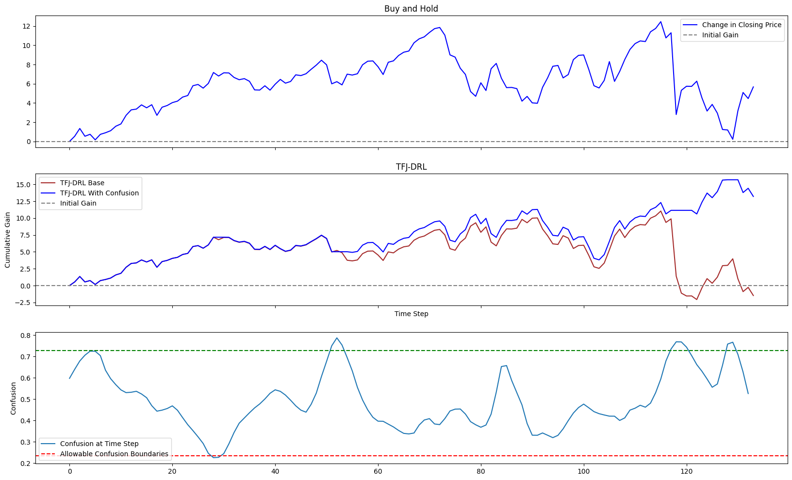

# TFJ-DRL-Update 1
@author Jack Bosco

Components:

1) A paper replication project for *Time-driven feature-aware jointly deep reinforcement learning (TFJ-DRL) for financial signal representation and algorithmic trading*. source: https://github.com/lingfeng158/TFJ-DRL-Replication
2) An exploritory project improving on the interpretibility of the TFJ-DRL model using XAI techniques to break open the black-box TAM-GRU model


## Background (credit lingfeng158)
* Supervised learning methods attempt to predict the stock price at the next time point and the trading action is inferred from that prediction. The issue with supervised learning for this application is the accuracy of price prediction results in second error propagation during translation from price prediction to trading actions. 
* Reinforcement learning (RL) methods lack the ability to perceive and represent environment features, as well as the ability to dynamically consider past states and changing trends. This means RL will struggle to converge with a sufficiently wide context window length and number of features per stock. 
* TFJ-DRL addresses these issues by combining supervised an reinforcement learning mechanisms in series to represent the environment and act within the environment, respectively.

## Installation

The most difficult part of setting this project up is getting TA-Lib working.
TA-Lib needs to be compiled from source before you can install the python package with pip.
The commands to do so are:

```
!wget http://prdownloads.sourceforge.net/ta-lib/ta-lib-0.4.0-src.tar.gz
!tar -xzvf ta-lib-0.4.0-src.tar.gz
%cd ta-lib
!./configure --prefix=/usr
!make
!make install
!pip install Ta-Lib
```

This is commented out on the top of the `full_model_demo.ipynb` notebook in `notebooks`. 


## RNN model and Temporal Attention Mechanism definition

The code for the GRU was refactored to [backend/reinforcement_learning.py](./src/backend/reinforcement_learning.py).
Its purpose is to extract meaningful features from the raw stock data, and it learns the feature representations via autoregression. 

Deep learning TAM-GRU mechanism looks like this:


The environment vector is fed through two feed-forward layers to produce a prediction for the stock price at time $t+1$.
This prediction, along with the latent environment vector, are then fed to a policy-driven reinforcement learning agent which decides on the action at time $t$ by picking one of $\{buy,\ sell,\ hold\}$.

Crucially, the black-box nature of this approach makes it highly unsuitable for trading with real money.
With a pure RL approach, the policy can be traced directly to movements in the underlying stock price and chosen indicators.
Similarly, a pure supervised approach which trades solely on the price prediction of $t+1$ can be monitered using the loss produced at time $t+1$ for time $t$.
Since TFJ-DRL is a combination of these approaches, a method for interpreting the predictions of TFJ-DRL must combine these approaches as well.

The purpose of this update is to \"crack open" the TFJ-DRL black box by applying XAI/interpretability techniques to the supervised learning mechanism and computing a `confusion' score.
Plotting the confusion of the supervised learning mechanism over the utility of the RL agent, we hope to determine when TFJ-DRL will lose money *before it trades*.

The original paper can be found [here](./src/ReferencePaper.pdf)

Full implementation can be found [here](./notebooks/full_model_demo.ipynb)

Notes on training one model to trade multiple stocks can be found [here](./notebooks/README.md)


# Confusion

Confusion is a measurement of how *new* the environment at time $t$ is to the model. 

The current implementation uses an autoencoder to encode and decode the environment vector $h'_t \in \mathbb R^{d}$ where $d$ is the environment vector dimention.
The autoencoder looks as follows:
```
AutoEncoder(
  (encoder): Sequential(
    (0): Linear(in_features=128, out_features=32, bias=True)
    (1): LeakyReLU(negative_slope=0.01)
    (2): Dropout(p=0.3, inplace=False)
    (3): Linear(in_features=32, out_features=16, bias=True)
    (4): ReLU()
    (5): Linear(in_features=16, out_features=2, bias=True)
  )
  (decoder): Sequential(
    (0): Linear(in_features=2, out_features=16, bias=True)
    (1): LeakyReLU(negative_slope=0.01)
    (2): Dropout(p=0.3, inplace=False)
    (3): Linear(in_features=16, out_features=32, bias=True)
    (4): ReLU()
    (5): Linear(in_features=32, out_features=128, bias=True)
  )
)
```

With $h''_t \in \mathbb R^{d}$ as the encoded-decoded environment vector, confusion at time $t$ is the cosine (dis)similarity:

$$\text{confusion}_t = 1 - \cos (h'_t, h''_t)$$

Critically, this loss is gleaned at time $t$ whereas the rest of the model recieves loss at time $t+1$. 
We hope to see a correlation between confusion at time $t$ and the loss at time $t+1$.
If this is the case, then confusion serves as an indicator for when the model is liable to lose money.



The above is a demonstatration of TFJ-DRL (top) and my addition (below). 
At a given timestep, the autoencoder generates a loss score from encoding and decoding the hidden state vector. 
Some of the peaks in confusion (ex. at around timestep 200) look promising as potential indicators of a dip in the cumulative gain.

