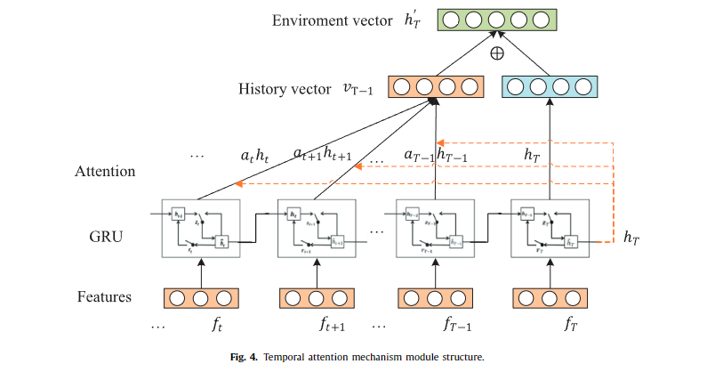

# TFJ-DRL-Update 1
1) A paper replication project for *Time-driven feature-aware jointly deep reinforcement learning (TFJ-DRL) for financial signal representation and algorithmic trading*. source: https://github.com/lingfeng158/TFJ-DRL-Replication
2) An exploritory project improving on the interpretibility of the TFJ-DRL model using XAI techniques to break open the black-box TAM-GRU model


## Background (credit lingfeng158)
* Supervised learning methods are difficult to achieve online learning, due to the cost of training. They attempt to predict stock prices of the next time point, but accuracy of price prediction results in second error propagation during translation from price prediction to trading actions.

* Reinforcement learning (RL) methods lacks the ability to perceive and represent environment features, as well as the ability to dynamically consider past states and changing trends. 

The paper of interest (TFJ-DRL) aims to combine the strength from both deep learning and reinforcement learning by integrating Recurrent Neural Network (RNN) and policy gradient RL.

## Installation

**ta-lib is optional**: I saved a sample dataset for training and testing the model, so you do not need to install ta-lib. 

If you would like to do so anyways, on Google Colab TA-Lib needs to be seperated installed via:
```
!wget http://prdownloads.sourceforge.net/ta-lib/ta-lib-0.4.0-src.tar.gz
!tar -xzvf ta-lib-0.4.0-src.tar.gz
%cd ta-lib
!./configure --prefix=/usr
!make
!make install
!pip install Ta-Lib
```

This is commented out on the top of the notebook in `notebooks`. 

## RNN model and Temporal Attention Mechanism definition

The code for the GRU was refactored to [backend/reinforcement_learning.py](./src/backend/reinforcement_learning.py).
Its purpose is to extract meaningful features from the raw stock data, and it learns the feature representations via autoregression. 

Deep learning TAM-GRU mechanism looks like this:



The environment vector is fed through two feed-forward layers to produce a prediction for the stock price at time $t+1$.
This prediction, along with the latent environment vector, are then fed to a policy-driven reinforcement learning agent which decides on the action at time $t$ by picking one of $\{buy,\ sell,\ hold\}$.

Crucially, the black-box nature of this approach makes it highly unsuitable for trading with real money.
With a pure RL approach, the policy can be traced directly to movements in the underlying stock price and chosen indicators.
Similarly, a pure supervised approach which trades solely on the price prediction of $t+1$ can be monitered using the loss produced at time $t+1$ for time $t$.
Since TFJ-DRL is a combination of these approaches, a method for interpreting the predictions of TFJ-DRL must combine these approaches as well.

The purpose of this update is to \"crack open" the TFJ-DRL black box by applying XAI/interpretability techniques to the supervised learning mechanism and computing a `confusion' score.
Plotting the confusion of the supervised learning mechanism over the utility of the RL agent, we hope to determine when TFJ-DRL will lose money *before it trades*.

The original paper can be found [here](./src/ReferencePaper.pdf)

Full implementation can be found [here](./notebooks/full_model_demo.ipynb)

Notes on training one model to trade multiple stocks can be found [here](./notebooks/README.md)